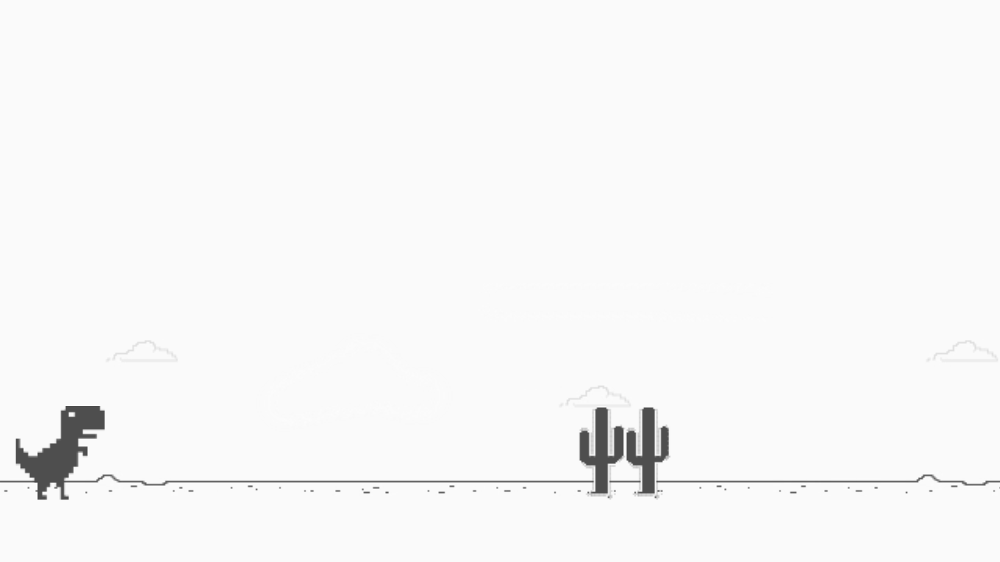

# :joystick: Game Dino :video_game:

Cópia do jogo do dinossauro, semelhante ao do Chrome quando fica sem conexão à internet, desenvolvido sobre orientação do instrutor [Celso Henrique](https://www.linkedin.com/in/devfrontend/) na plataforma [Digital Innovation One](https://digitalinnovation.one/).

## :camera: Captura de telas

- Tela do Jogo

- Tela _game over_ do Jogo

## :rocket: Tecnologias Utilizadas

- [HTML](https://developer.mozilla.org/pt-BR/docs/Web/HTML)
- [CSS](https://developer.mozilla.org/pt-BR/docs/Web/CSS)
- [JavaScript](https://developer.mozilla.org/pt-BR/docs/Web/JavaScript)

## :memo: Licença
Esse projeto está sob a licença MIT. Veja o arquivo [LICENSE](LICENSE) para mais detalhes.
